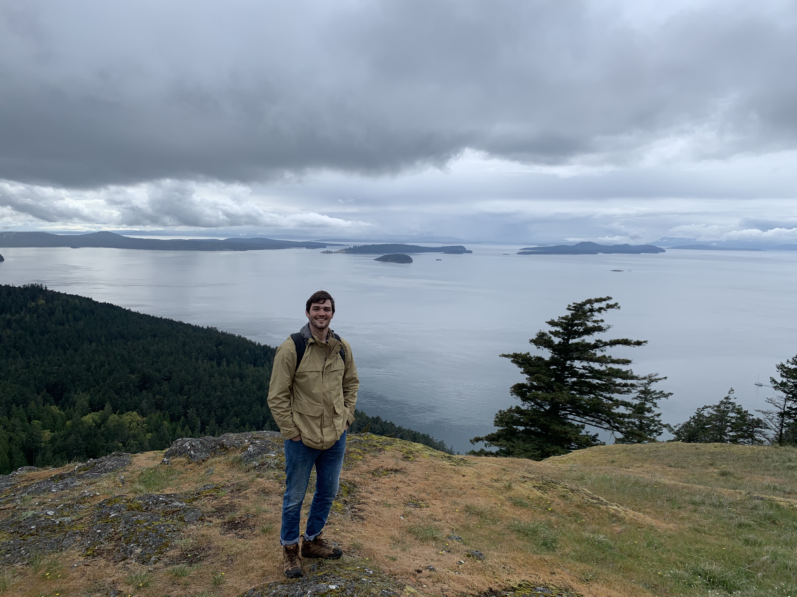

# Hi I'm Alex!

<div class="gif-fade">
  
  
</div>
  
# As An Engineer
I was always asked the age-old question:
```shell
What do you want to do when you grow up?
```
And now I have an answer:
```shell
I want to solve the most complex problems in the most elegant way
```
And I should also add this disclaimer:
```shell
I want to teach my teammates my elegant solutions... and I want to learn theirs as well
```

For a more in-depth breakdown of my skillset and experience, hop on over to [my experience page]()
# As A Human

:man_running: I like to hike  
:man_surfing: I am not very good at surfing   
:computer: I live to code   
:book: I quite frequently read   
:punch: I practice Muay Thai 

# About this site 
There is no hosting solution behind this website.  
This website is my profile, portfolio, and blog. But it also intended to be a resource for budding engineers who need some help getting started.  
So let's go through the workflow:

* This site was built almost entirely with markdown.
* Some supporting infrastructure was deployed to [AWS]() with [terraform]().
* The code was aggregated and converted to HTML via [mkdocs]() and [ansible]().
* Finally, [ansible]() did some final work to upload everything to [AWS]().

This website, in itself, is part of my portfolio! However, I encourage you
to also hop over to [my portfolio](https://dash.engineeringwithalex.io) to 
see some more fun projects.
